[SendGrid](https://sendgrid.com/) es un servicio de envío de correo electrónico que ofrece opciones de pago y gratis (free), en el caso de esta ultima se permite el envío de 25.000 correos al mes sin costos.

En esta oportunidad se indicará como configurar este recurso en Azure para cuando tus proyectos requieren del servicio de correo electrónico.

Primero nos dirigimos al menú (lado izquierdo) y seleccionamos la opción de “Crear nuevo recurso”.

  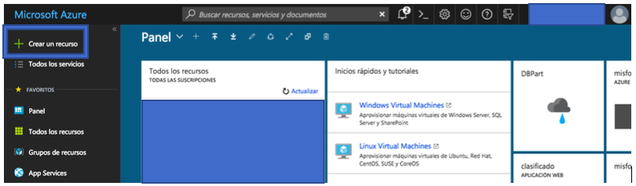

A continuación veremos una ventana donde nos aparecen todas las opciones para crear recursos en Azure, nosotros buscaremos SendGrid y presionamos Enter.

  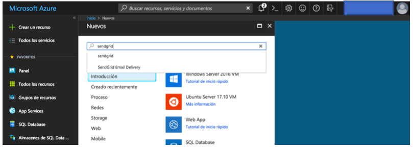

En los resultados de la búsqueda nos aparecerá “SendGrid Email Deivery” y haremos click este resultado.

  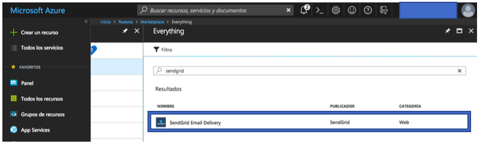

Una vez seleccionado el resultado nos aparecerá una ventana que nos indicará los detalles del recurso que comenzaremos a configurar, presionaremos en el botón “Crear” y continuamos.

  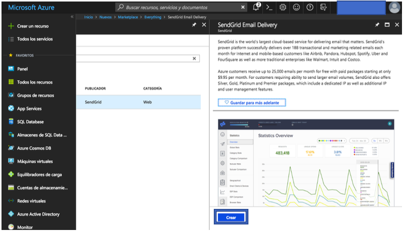

Ahora veremos un formulario que deberemos llenar inicialmente con el nombre que destinaremos al recurso, la password, a demás deberemos seleccionar nuestra suscripción y definir el grupo al que pertenecerá el recurso, el cual podrá ser uno nuevo o utilizar uno ya existente (en el caso de cuando configuramos un proyecto).

  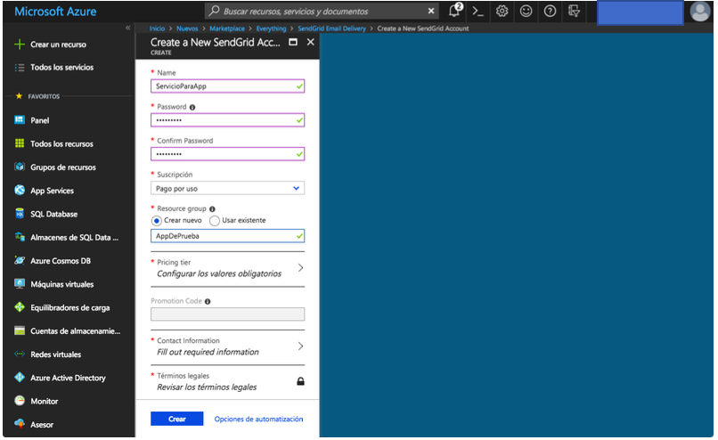

Luego seleccionaremos nuestra opción de servicio (Pricing tier), el cual podrá ser de pago o en este caso Free. Recordar que esta ultima opción tiene la limitante de los 25.000 correos por mes. Una vez marcada la opción presionamos el botón “Seleccionar”.

  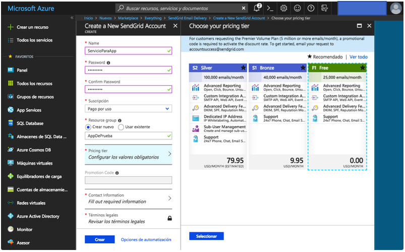

Ahora, llenaremos el formulario con los datos de nuestros datos de contacto, este proceso es muy sencillo y una vez que este completo seleccionamos el botón “Aceptar”.

  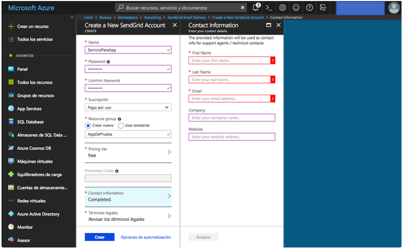

Finalmente aceptamos las condiciones de los términos legales para ya terminar de configurar esta primera parte del recurso y presionamos el botón “Crear”.

  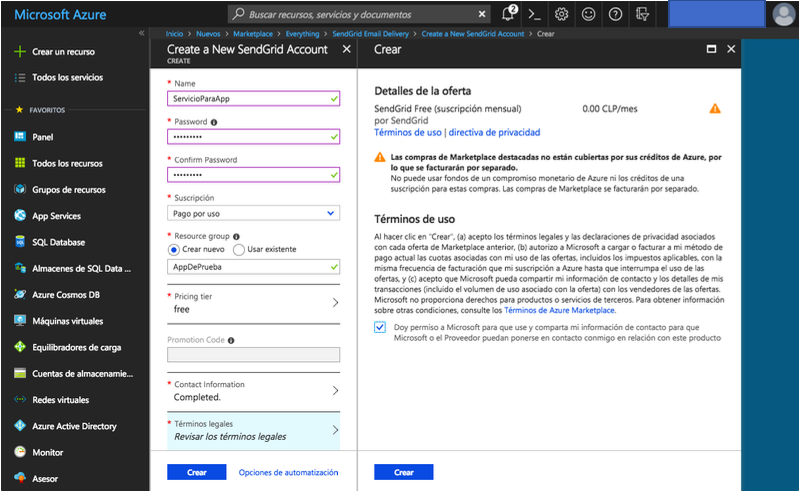

Nuevamente presionamos el botón “Crear”. En este momento se comenzará a construir el recurso y nos mantendrá informado de este proceso. Solo debemos esperar.

  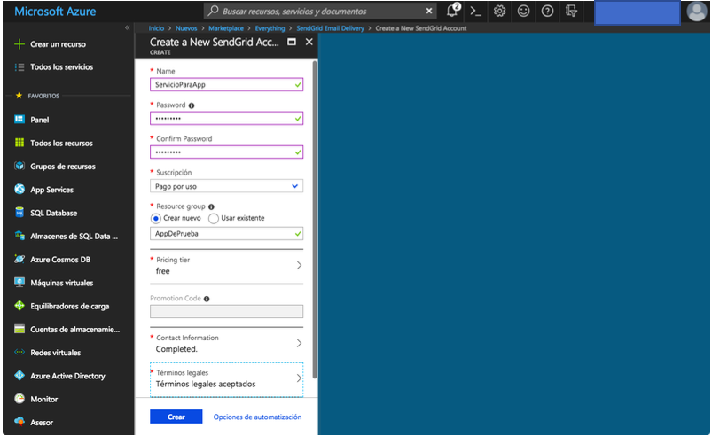

Una vez que se haya terminado la creación del recurso nos indicará en el icono de notificaciones (en la parte superior) que todo fue realizado con éxito y podremos dirigirnos a revisar.

Para poder chequear el recurso presionamos el botón “Ir al recurso” y así poder obtener los datos necesarios que nos permita utilizar el servicio de envío de correos electrónicos.

  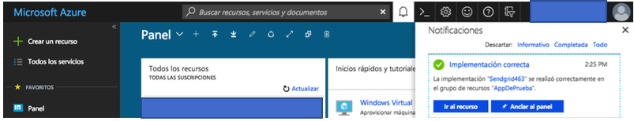

En la siguiente ventana observamos el recurso ya configurado.

Para continuar con la revisión del recurso en esta guía mostrare dos de todas las opciones que tenemos.

Esta primera opción es la de poder administrar el servicio desde la misma página de SendGrid y para ello seleccionamos el botón “Manage”.

  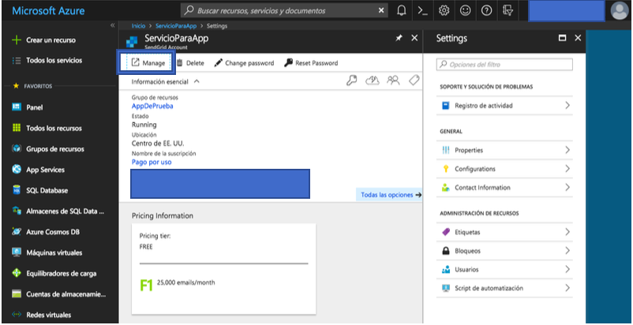

A continuación veremos la pagina de SendGrid y nos nuestra un sitio donde podremos administrar nuestro servicio, aquí podremos verificar los envíos de correos electrónicos y todos sus estados, podremos realizar configuración y obtener las API Key en caso de que la necesitemos. El sitio es bastante intuitivo y nos familiarizaremos rápido con él.

  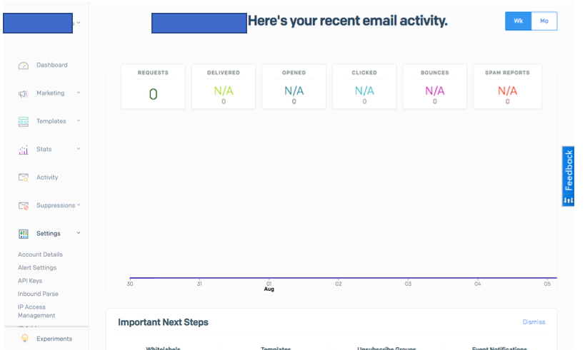

Otra de las opciones utilizadas es la de poder acceder rápido a ver los datos para utilizar nuestro servicio, como por ejemplo el SMTP.

Para poder acceder a esto, basta con hacer click en la opción “Configurations” a mano izquierda.

  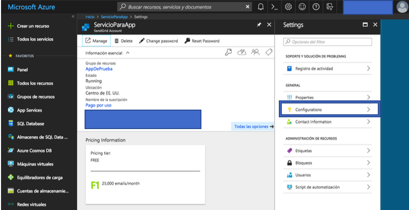

Esto nos mostrará algunos datos para la configuración del servicio en alguna App.

  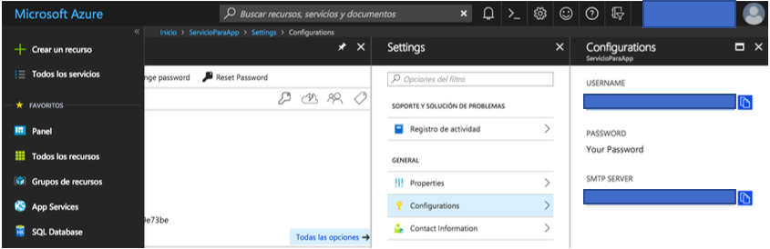

Y nada mas que decir en esta guía, con esto ya estaremos utilizando nuestro recurso SendGrid en Azure para el envío de correos electrónicos.

Espero que les resulte de ayuda.