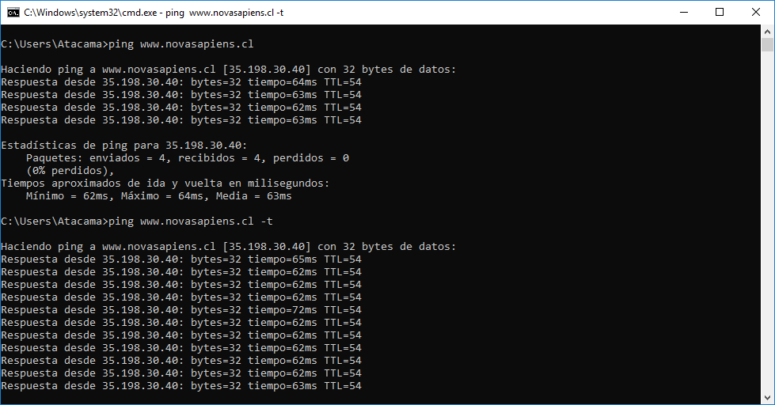

Tener habilitado el protocolo ICMP en servidores y equipos, de alguna forma, considerando su utilización y su importancia, habrá algunos que opten por mantenerlo y otros, definitivamente, es lo primero que tienden a deshabilitar. Lo podemos hacer a través del propio firewall del equipo o si tenemos un router, trabajarlo en él.

Considerando la seguridad (y la postura que se tenga frente a ésta), es importante bloquear ciertos tipos de ICMP, pero no todos ellos, ya que este protocolo realiza una función fundamental en las redes de datos.

Algunos tipos de ICMP permiten descubrir posibles problemas, y otros son esenciales para que la red funcione correctamente, sobre todo si estamos trabajando con IPv6 donde el uso de ICMPv6 es continuo.

Ahora, el favorito de todos:

**Ping (Echo Request y Echo Reply)** Este es el tipo de ICMP que nosotros utilizamos más, la popular herramienta ping nos permite saber si podemos llegar hasta un host remoto sin problemas, siempre y cuando dicho host remoto permita contestar a los diferentes pings.

**¿Es recomendable desactivar el “ping” a través del Firewall?**

- Si por ejemplo tienes un servidor donde alojas tu servidor web y tienes abierto el típico puerto 80, de nada te servirá desactivar el ping ya que a través del servicio web ya se sabe que “existes”. Conclusión: No deshabilites el ping en la WAN.
- Si no tienes ningún servicio corriendo o los tienes en puertos que no son los predefinidos, entonces sí es recomendable bloquear el ping, de esta manera un usuario remoto que intente hacer ping contra ti no recibirá contestación, y pensará que no hay ningún equipo en línea en ese momento y con esa IP pública. Conclusión: Sí sería recomendable desactivarlo para pasar desapercibido.

**¿Si deshabilitamos el ping en la WAN eso significa que nosotros tampoco podremos hacer ping a otros hosts?**

Sí podremos hacer ping, siempre y cuando filtremos en el firewall correctamente el protocolo ICMP, por ejemplo si nuestro firewall es iptables podemos hacer lo siguiente:

> ```
>         iptables -A INPUT  -p icmp --icmp-type echo-request -j DROP
> ```

Esta regla para IPv4 bloquea en el firewall cualquier “ping” entrante, de tal forma que pasaremos desapercibidos, pero nosotros sí podremos hacer ping sin problemas (siempre y cuando no tengamos otra regla de DROP en los cortafuegos o política de DROP sin ninguna regla específica de ACCEPT).

Lo que sería recomendable es bloquear el ping en la WAN, pero no en la LAN, porque si lo bloqueamos en la LAN ya no podremos hacer el típico “ping 192.168.1.1” a nuestro router. Por último, debemos tener en cuenta que permitir el ICMP consume recursos de los dispositivos, por tanto sería interesante que limitéis el número de ICMP que puedes recibir en, por ejemplo, un minuto, de esta manera el resto de ICMP se descartarán.