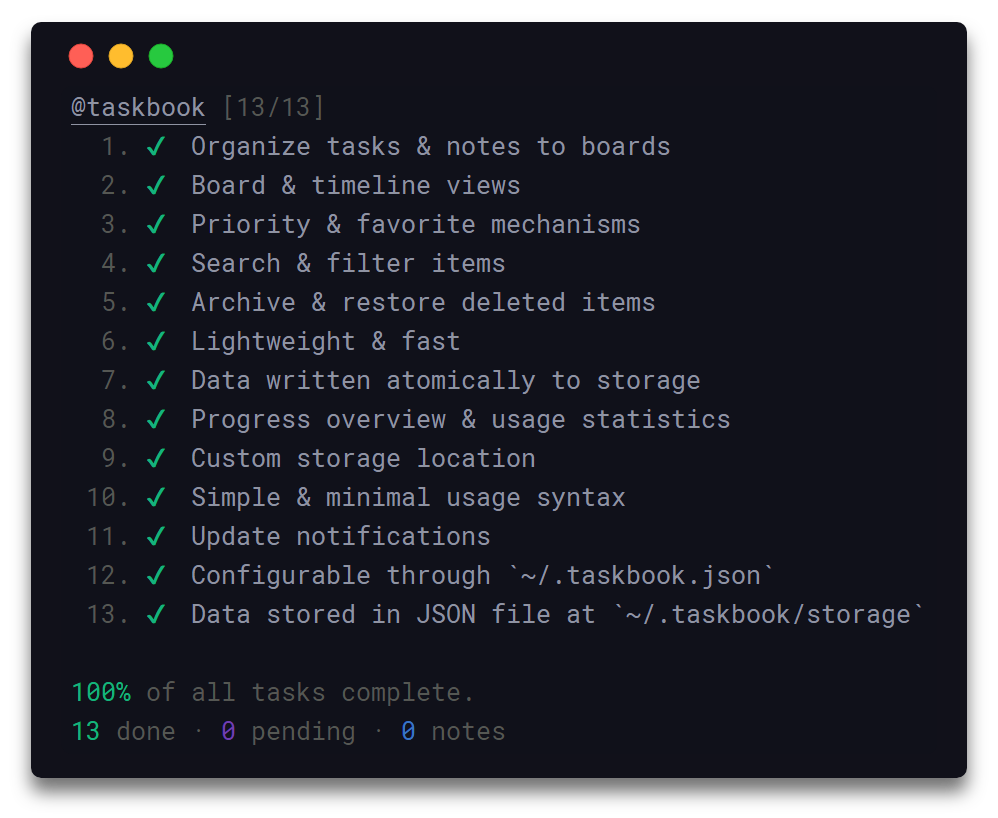

La organización de tareas o actividades de cualquier tipo, es practicamente una parte fundamental del dia de cualquier persona que requiera planificar de forma óptima la gestión de su tiempo.

Para esto, existe una serie de herramientas que van desde la utilización de la clásica libreta de apuntes (~~para los que aún recuerdan como escribir a mano~~), hasta sistemas pagados que se encargan de ordenar todas las actividades que desees. Pero en esta oportunidad, he decidido compartir una excelente herramienta que para los que son amigos de la terminal, tanto en GNU/linux como en algún otro sistema operativo compatible con npm, y trabajan mucho en este ambiente (ya que para los entornos, por ejemplo web, existe Trello - Excelente gestor de actividades).

La aplicación para el entorno de la terminal dedicada a la gestión de actividades, se llama Taskbook. ([Taskbook - Github](https://github.com/klauscfhq/taskbook))

A pesar de que la aplicación no cuenta con una interfaz gráfica, permite (entre otras cosas):

- Crear tareas o notas con un solo comando.
- Mover tareas entre los diferentes tableros.
- Añadir filtros de búsqueda para buscar contenidos en las tareas.
- Editar y borrar las tareas.

Para instalarlo se requiere tipear lo siguiente en una terminal:

´´´
sudo npm install –global taskbook
´´´

Para ver las opciones disponibles en el programa:

´´´
tb -help
´´´

Taskbook es configurable utilizando el archivo json que está ubicado en nuestra carpeta personal y que posee como nombre .taskbook.json.

La información de la aplicación, a no ser que se modifique, se almacena en la carpeta taskbook/storage, ubicada también en la carpeta personal del usuario.

La aplicación es configurable utilizando el archivo json que está ubicado en nuestra carpeta personal y que posee como nombre .taskbook.json. La información de la aplicación, a no ser que se modifique, se almacena en la carpeta taskbook/storage, ubicada también en la carpeta personal del usuario.