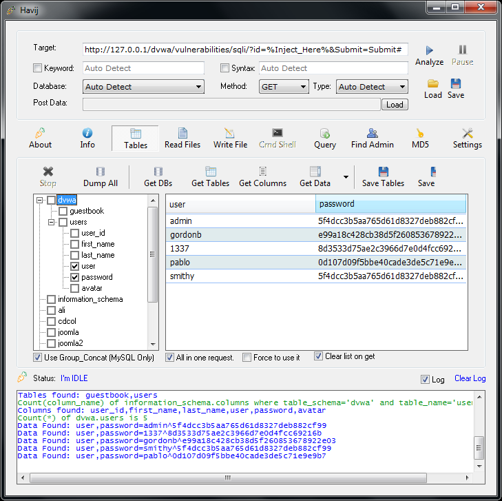

Los ataques a las vulnerabilidades de los sistemas es algo presente y frecuente en las actividades de los administradores de sistemas o DevOps (término más NewAge) casi de forma diaria.

Estos ataques pueden ir a un universo de vulnerabilidades probables existentes en toda la infraestructura informática, pasando desde tus estaciones de trabajo, hasta servidores y redes, pasando por bases de datos, aplicaciones y servicios de diversa índole.

Es por este motivo, que la auditoria de servicio e infraestructura informática es un proceso fundamental con la finalidad de detectar las vulnerabilidades idealmente antes que cualquier intruso. Este proceso, nos ayudará al menos a mejorar continuamente para poder asegurar la información y ofrecer servicios de mejor calidad.

En esta ocasión, les quiero mostrar una aplicación para Windows, cuya finalidad de verificar si existen problemas relacionado a un ataque llamado SQL Inyection, el cual es sufrido en la mayoría de las veces, por sitios web mal programados o con configuraciones paupérrimas.

**Havij**, es la aplicación que ayuda a la detección de estas vulnerabilidades en el sitio web que desees probar.

[Descarga desde aqui](https://www.darknet.org.uk/content/files/Havij_1.12_Free.zip)

Desarrollada por ITSecTeam (compañía iraní de seguridad), Havij permite a través de una interfaz gráfica de muy fácil uso, analizar si esta vulnerabilidad existe en algún sistema que deseemos testear (pasándole una url + el método usado – como GET o POST – y un numero de envío de petición), como por ejemplo:

```
http://127.0.0.1/sistema/busqueda.php?id=2
```



Si bien es cierto, que pueden existir varias herramientas más dedicada a esta finalidad, Havij aún tiene funcionalidad y tiene orientación a realizar un testeo de primer nivel.

Principales características de Havij:

- Soporte de http / https.
- Aun posee mantenimiento y actualizaciones.
- Facil utilización.
- Incluye MS SQL Blind.
- Blind MSAccess (solo en la versión de pago).
- Soporte para sistemas con PostgreSQL.
- Altamente configurable al momento de parametrizar su uso.
- Información resulto de fácil interpretación.

Cabe mencionar que existe una versión gratis y otra de pago, evidentemente con otras características adicionales.

Busca en google con estos parámetros y sorprendete viendo los listados de resultados que se ha encontrado en algunos sitios.

```
"havij report" "target" ext:html
```