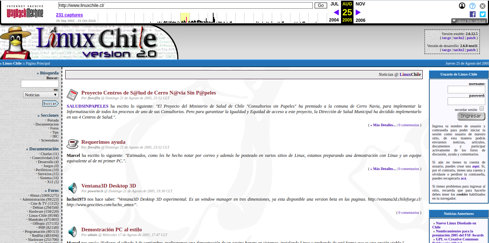
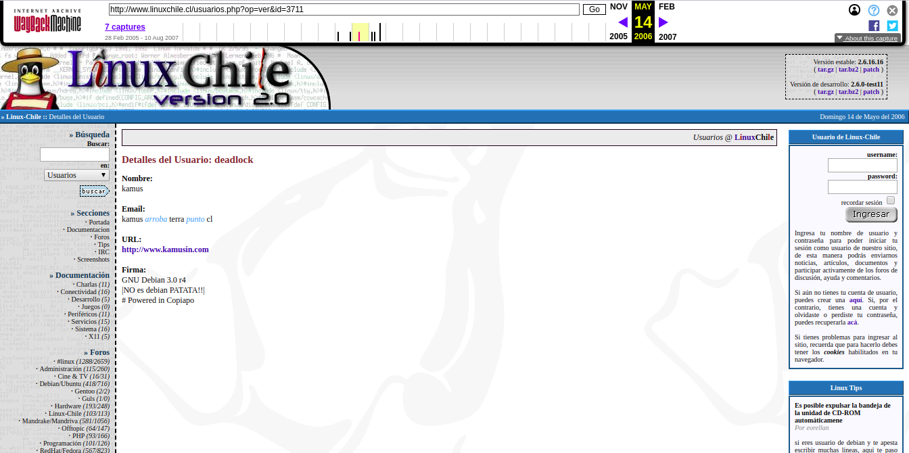
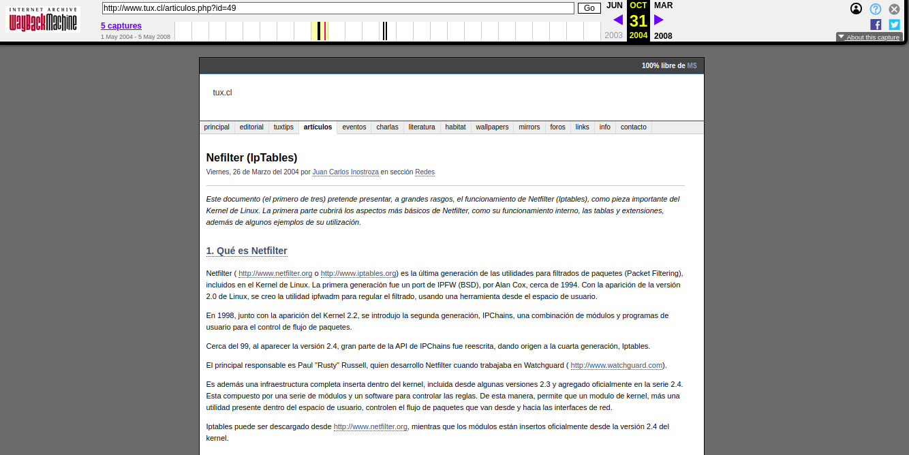

# La vida en los 2000s

Me parece oportuno en estos momentos, sin precedente alguno en la historia moderna, deternos a pensar en muchas cosas que hoy en dia damos por hecho y sin mucho valor alguno. El conocimiento y informacion que tenemos actualmente en el **2020** es por decir lo menos masivo. La mayoria de los blogeros e influencers se tomaron las redes sociales (Facebook), streaming (Youtube) y si quieres elaborar tu propia identidad o marca la mayoria comienza a redactar un articulo en `Medium` o simplemente alguna plataforma de microblogging (Twitter).

La vida en el principio de los 2000s pues no era tan rosa y acelerada como lo es ahora. Tener una conexion a internet en ese entonces era un **privilegio** y mas aun la indexacion de contenidos era dominado en ese entonces por unos cuantos motores de busqueda como `altavista.com` o `yahoo.com`, y los contenidos eran limitados claro. Ni hablar de encontrar informacion en nuestro idioma, ya que en ese entonces, **Linux** como sistema operativo estaba aun en su adolescencia y los pocos libros que llegaban al mercado local eran escasos (tuve la suerte de encontrar unas revistas de Espana, pero solo las conseguia cuando podia viajar a Santiago). Ni hablar de comprar un curso online en `Coursera` o adquirir una cuenta en `acloud.guru`, pues todo el conocimiento disponible era casi limitado a unos pocos, y siento que parte de la comunidad lo queria mantener en secreto o restringirlo a unos pocos priviligeados. 

Sin embargo, las comunidades emergieron, y aparecieron ciertos actores, que en su mayoria eran amigos o conocidos, y comenzaron a crear **foros** online, donde el conocimento era libre para todo el que lo estuviera buscando. Recuerdo muy bien los dias negros cuando el hardware disponible no era suportado en el Kernel (2.2 - 2.4) o para poder configurar tu Modem necesitas recompilar el kernel con el modulo exacto de tu NIC. Para ponerte en perspectiva, compilar un Kernel en el presente,no dista mucho de 20 anos atras, requiere un conocimiento tecnico mas que basico para realizar dicha tarea y el exito no esta garantizado. 

Una de las primeras comunidades que conoci en ese entonces fue la de **linuxchile.cl** y **tux.cl**. Las cuales parecian tener algun grado de rivalidad, pero como consumidor del sistema operativo la verdad me daba un carajo, pues yo solo queria aprender y alcanzar mi objetivo. Un set de heroes online dedicados a redactar articulos, tips, compartir una captura de pantalla de sus escritorios se daban a conocer a la comunidad, nicknames como Edsiper (Eduardo Silva), fcatrin (Franco Catrin), Max (Max Celedon), Radix (nunca lo pude conocer) y JCI - Juan Carlos Inostroza (Que en paz descance), parecian ir anos luz en comparacion a todo lo que se habia visto hasta ese entonces. 

Notar como en ese entonces ya se estaban utilizando sitios dinamicos en PHP y los tutoriales disponibles eran para configurar una base de datos relacional como MySQL, un servidor de correos con Postfix (y autenticacion con MySQL), un servicio de DNS con `bind9` y un monton de otras cosas que hoy por hoy con la base de servicios disponibles en muchos servicios cloud publicos como `Amazon Web Services` o `Google`. 

Segui navegando en WaybackMachine y encontre este pequeno tutorial que escribi acerca de como configurar un Modem en Linux. Admito que mi conocimiento en ese entonces era limitado, pero la idea de pertenecer a una comunidad y contribuir con algo de vuelta generaba un valor que hasta el dia de hoy no habia evaluado.

Juan Carlos Inostroza aka JCI, un procer y heroe que inspiro a muchos aficionados, en particular no puedo dejar de homenajear a una persona intelectualmente superior y ademas comprometido con la comunidad y la lucha de convertir Linux/Software libre entendible para todos. La comunidad Linuxera y en particular, siempre te recordare como un mentor (junto a todos los que ya he mencionado en este post) y tu persona jamas sera olvidada dentro de la comunidad Linuxera, me atreveria a decir en Latino America y el mundo.
