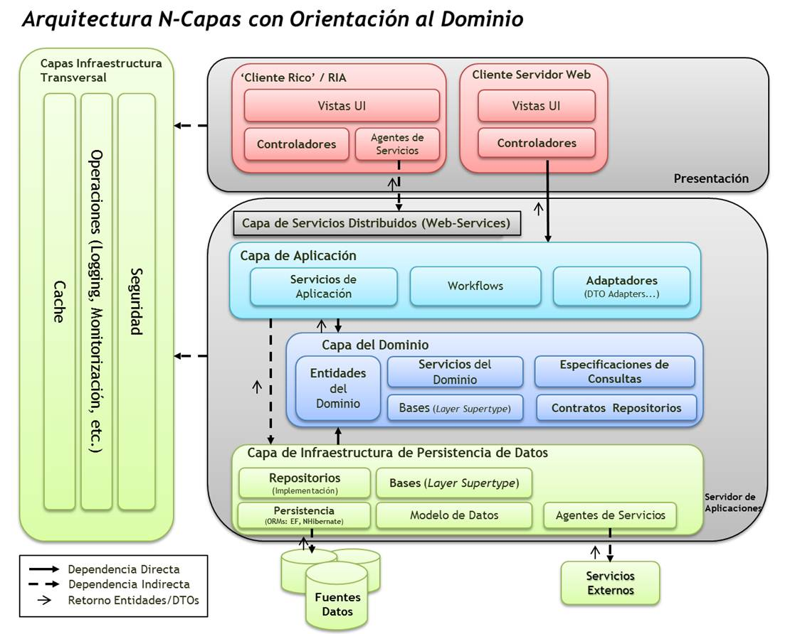

Mi proceso de reaprendizaje ha resultado ser un poco golpeado, jajajaja, la verdad es que bien golpeado.

Actualmente me encuentro leyendo libros de patrones de diseño, de arquitectura y buenas prácticas, pero por mi nuevo trabajo me vi en la necesidad de aprender rápido DDD del inglés Domain-Driven Design (Diseño guiado por eventos).

Algunas de las premisas de DDD (Wikipedia)

·     Poner el foco primario del proyecto en el núcleo y la lógica del dominio.

·     Basar los diseños complejos en un modelo.

·     Iniciar una creativa colaboración entre técnicos y expertos del dominio para interactuar lo más cercano posible a los conceptos fundamentales del problema.

En mi primer intento busque videos y ejemplos de como poder implementar la arquitectura en distintos lenguajes, aunque mi necesidad directa era C#. Hice lo ejemplos y me funcionaron, incluso realicé algunos diagramas para poder entender de mejor manera el concepto y me sentía capaz de hacer mi primera pequeña aplicación. Con toda mi motivación y mis apuntes a mano, abrí el editor y comencé a escribir código, pero, no pude evitar el golpe, un golpe demasiado duro y me sentí perdido, fracasado y con ganas de volver el tiempo atrás (no haber renunciado a mi trabajo para retomar mi carrera de desarrollador). Nada me funcionaba y peor aún, mis apuntes y diagramas no me daban ninguna claridad.

Comencé a reorganizar todo, así que tomé mis libros, mis apuntes y videos, organicé un nuevo plan de estudios en base a mis errores cometidos en mi primer intento, ahora todo comenzaba a tener mayor claridad. Me dediqué a entender DDD completamente, su propuesta, su metodología de trabajo y los beneficios que tiene y una vez terminado con ello, comencé a ver videos de devs que realizaban ejemplos y también revisar repositorios en GitHub. 

Ahora sí, primero realice los diagramas de la aplicación de ejemplo que realizaría basada en DDD y recién comencé a escribir código, me daba golpes, pero no me hacían caer como en mi primer intento, pues me aseguraba de que cada capa estuviese bien construida, aunque cuesta en un inicio pensar en capas y dejar de pensar en la solución completa (aunque sepas cual es y seas tu solo desarrollando), cuando yo soy fiel creyente del concepto “divide y vencerás”, y si, ahora si fue el caso de éxito, mi aplicación funciono, obviamente con cosas que mejorar, pero al fin podía ver la arquitectura funcionando, fue demasiado gratificante y motivador.

Finalmente, me encuentro desarrollando la aplicación de mi nuevo trabajo en la arquitectura DDD, sin inconvenientes y con muchos beneficios, sobre todo en su orden y escalabilidad, esto gracias a darme cuenta de que no se trata solo de definir estructuras de carpetas y comenzar a desarrollar, no, se trata de que cuando adoptas un arquitectura de desarrollo viene acompañado de metodologías de trabajo y buenas prácticas entre otras cosas, es por esta razón que primero debes profundizar mucho en la arquitectura antes de implementar la solución.

Me daré el tiempo para poder compartir mi experiencia en este desafío.