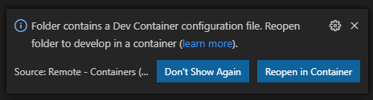
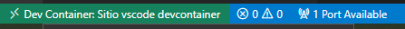
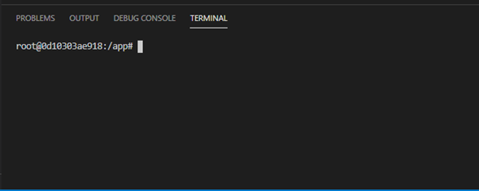
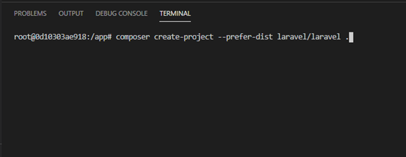
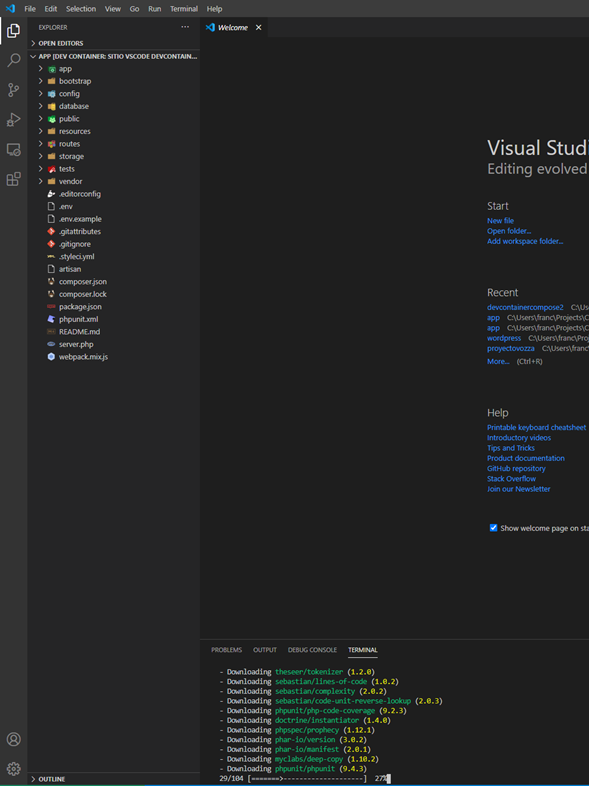
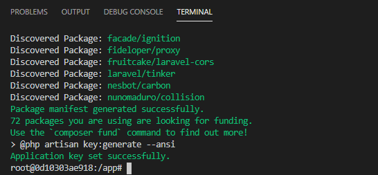
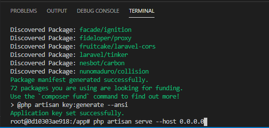
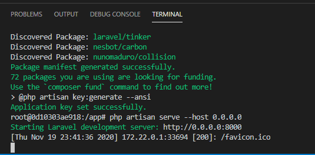
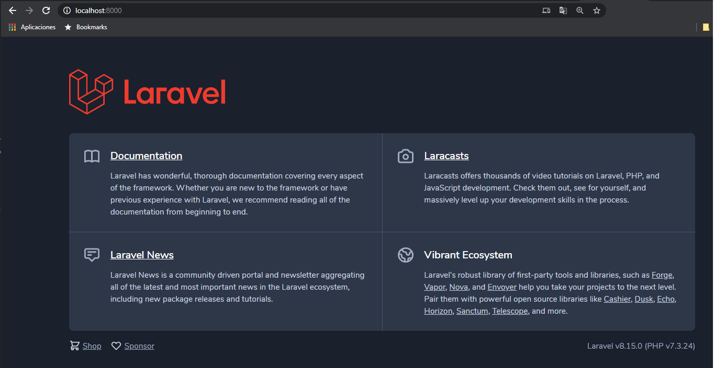
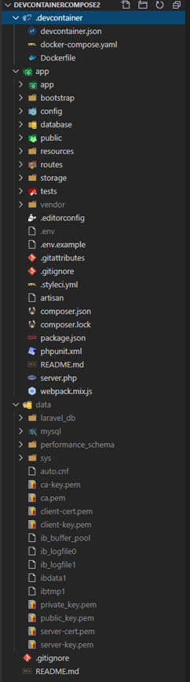

En mi proceso de reaprendizaje he estado probando distintos lenguajes, base de datos y frameworks, entre otras cosas más, es por esta razón que he optado por la opción de usar Docker para configurar mis entornos de desarrollo según mis necesidades.

Para esto requerimos de tener instalado Docker Desktop (https://www.docker.com/products/docker-desktop), Visual Studio Code (https://code.visualstudio.com/Download) y un plugin del editor llamado Remote - Containers (https://marketplace.visualstudio.com/items?itemName=ms-vscode-remote.remote-containers), con esto podremos conectarnos desde VS Code a los contenedores Docker que tengamos configurados y corriendo.

Para crear un entorno de desarrollo con PHP y MySQL, primero crearemos una carpeta con el nombre de nuestro proyecto, en este caso le pondré “devcontainercompose2”, en su interior crearemos otra carpeta con el nombre “.devcontainer”, este nombre no puede cambiar, de este modo VS Code detectara que tenemos un entorno configurado con contenedores.

Ahora, en la carpeta “.devcontainer” crearemos los siguientes archivos: Dockerfile, devcontainer.json y docker-compose.yaml, a continuación explicare el contenido de cada archivo y que responsabilidad tienen.

**Dockerfile:** este archivo creara una imagen local a partir de una ya existente en Docker hub (https://hub.docker.com/), lo que se hace es agregar algunas extensiones y aplicaciones necesarias para trabajar con algunos frameworks, como por ejemplo Laravel.

```dockerfile
FROM php:7.3-fpm
WORKDIR /app
RUN apt-get update && apt-get install -y \
    build-essential \
    libpng-dev \
    libjpeg62-turbo-dev \
    libfreetype6-dev \
    locales \
    zip \
    jpegoptim optipng pngquant gifsicle \
    vim \
    unzip \
    git \
    curl \ 
    libpng-dev \
    zlib1g-dev \
    libzip-dev \
    wget

RUN docker-php-ext-install pdo_mysql mbstring zip exif pcntl
RUN docker-php-ext-configure gd --with-gd --with-freetype-dir=/usr/include/ --with-jpeg-dir=/usr/include/ --with-png-dir=/usr/include/
RUN docker-php-ext-install gd

RUN curl -sS https://getcomposer.org/installer | php -- --install-dir=/usr/local/bin --filename=composer

RUN curl -sL https://deb.nodesource.com/setup_14.x | bash -
RUN apt-get install -y nodejs

RUN apt-get clean && rm -rf /var/lib/apt/lists/*

EXPOSE 9000 8000
```

**docker-compose.yaml:** aquí configuramos la orquestación de nuestros dos contenedores, el primero será nuestra aplicación, el cual se crea a partir de la imagen mencionada anteriormente y se suma otro contenedor que se encargara de ejecutar MySQL. Aquí se especifican los puertos que se expondrán, las variables de entorno, etc. Hay dos cosas muy importantes en estas configuraciones, las cuales se especifican en el contenedor principal donde trabajaremos, que en este caso es “app”. Lo primero es “volumes”, aquí definimos nuestra carpeta de trabajo, la cual será “app” tanto en el contenedor y en el equipo local. Lo segundo es “tty: true”, esto es muy importante, ya que así podremos acceder a la terminal del contenedor desde VS Code.

```yaml
version: '3.7'
services: 
    app:
        container_name: devcontainercompose2_app
        build: .
        ports: 
            - 8000:8000
        volumes: 
            - ../app:/app
        tty: true
        depends_on: 
            - mysql
    mysql:
        container_name: devcontainercompose2_mysql
        image: mysql:5.7
        ports: 
            - 3306:3306
        environment: 
            MYSQL_ROOT_PASSWORD: M4st3rdb4
            MYSQL_USER: laravel_user
            MYSQL_PASSWORD: .s3cr3t0.
            MYSQL_DATABASE: laravel_db
        volumes:
            - ../data:/var/lib/mysql
```

**devcontainer.json:** finalmente se escribe la configuración para que VS Code sepa donde esta cada cosa, aquí muestro una configuración básica para el proyecto. Algunas cosas importantes son: 

·     Donde se encuentra el archivo que contiene la configuración de los contenedores. 

·     El nombre del contenedor principal de trabajo, en este caso “app”. 

·     La carpeta de trabajo o del proyecto que se encuentra en el contenedor. 

·     La Shell que utiliza nuestro contenedor principal.

```json
{
    "name": "Sitio vscode devcontainer",
    "dockerComposeFile": "./docker-compose.yaml",
    "service": "app",
    "shutdownAction": "stopCompose",
    "workspaceFolder": "/app",
    "settings": {
        "terminal.integrated.shell.linux": "/bin/bash"
    }
}
```

Una vez configurado todo esto, nos ubicamos en la carpeta del proyecto “devcontainercompose2” y abrimos VS Code (code .).

VS Code nos mostrara la siguiente ventana y le damos clic a “Reopen in Container”



Con esto se comenzará a crear la imagen local, se crearán los contenedores y nos encontraremos conectados al contenedor principal “app” (este proceso tardara un poco).

Probablemente en el proceso nos aparecerán ventanas de Docker preguntando sobre las carpetas que se crearan, estas carpetas corresponden a “app”, la cual corresponde a nuestra aplicación y la otra es la carpeta “data”, donde se crearan los archivos de las bases de datos en MySQL para que cuando cerremos los contenedores no se pierda la información. Bueno, en estos casos le damos que si a la creación de las carpetas.

Una vez terminado todo este proceso, VS Code nos indicara que esta conectado a nuestro contenedor.



Luego desde el mismo VS Code abriremos una terminal.



Ahí nos podemos dar cuenta que estamos conectados al contenedor y podremos comenzar a trabajar, en este caso creare un proyecto de Laravel de ejemplo.



El proyecto se está creando.



Y listo, nuestro proyecto esta creado.



Ahora ejecutare levantare el sitio con artisan.



Nuestro sitio está funcionando y listo para trabajar.





Si revisamos la estructura de nuestras carpetas en el equipo local (anfitrión) podremos ver el contenido generado.



Aquí https://github.com/francolmc/devcontainercompose2 pueden encontrar el mismo ejemplo y aquí (https://code.visualstudio.com/docs/remote/containers) hay mayor información por parte de VS Code al respecto.